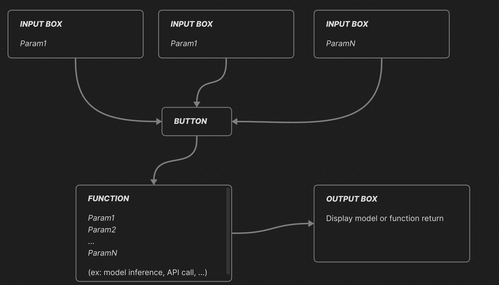

# Building an MCP Server to Interact in Natural Language with Any PostgreSQL Database Using Gradio and Koyeb

### _**Introduction:**_

Lately, I’ve been diving into MCP servers.  
As more and more well-known LLM providers integrate support for MCP clients (Claude Desktop, Cursor, Tiny Agents, etc.), it's becoming clear that MCP servers are on their way to becoming a standard interface for interacting with complex data.

During my research, I discovered a powerful new feature in the Gradio library: **native MCP server compatibility**.

The promise is simple: you can now _**turn any Gradio interface into an MCP server**_ (currently compatible only with the SSE protocol at the time of writing).

In this tutorial, I’ll show you how it works and how we can deploy it effortlessly using _**Koyeb**_.

---
## 📚 Table of Contents

- [Quick Recap on MCP](#quick-recap-on-mcp)
- [Requirements](#requirements)
- [1) First, We Need a Database](#1-first-we-need-a-database)
  - [Building the database](#building-the-database)
  - [How to easily deploy our database to Koyeb ?](#how-to-easily-deploy-our-database-to-koyeb-)
- [2) Building the Gradio interface](#2-gradio-interface)
  - [The Workflow of Exposing Tools](#the-workflow-of-exposing-tools)
  - [Deploying on Koyeb](#deploying-on-koyeb)
  - [Testing the server](#testing-the-server)
- [Conclusion](#conclusion)

---

### Quick Recap on MCP

LLMs have become increasingly **accurate** and **versatile**, but they still face two major limitations:

- They can't reason over data they haven't seen.
- They can't take direct action.

This is where the _**Model Context Protocol (MCP)**_ comes in.  
Released by [Anthropic](https://www.anthropic.com/), [MCP](https://modelcontextprotocol.io) aims to become the universal standard for enabling _**LLMs to communicate**_ with external data sources.

Think of it like the web: you have a client and a server communicating via HTTP.  
With MCP, you have an MCP client making requests to an MCP server to overcome those two limitations above with three key components:

- **Tools** – Actions that your MCP server exposes to enhance the model’s capabilities:
    - Calculator
    - Email sender
    - Embedding generator
    
- **Resources** – Contextual data that the model can reason over:
    - Real-time weather
    - Your personal data
        
- **Prompts** – Predefined templates to guide the model in specific tasks:
    - Q&A
    - Guidelines
    - Formatting

#### _**Concretely, how does it work?**_

Your MCP client expects a single entry point that allows it to discover what your server is exposing.

A _typical configuration in Claude Desktop_ might look like this:

```json
{  
  "mcpServers": {     
    "gradio": {      
      "url": "http://<YOUR_SERVER>/gradio_api/mcp/sse"     
    }   
  } 
}
```

The [MCP library](https://modelcontextprotocol.io/docs/concepts/resources) you use generates a standardized “documentation” about the tools and resources that you expose. The model retrieves it when connecting to the `/sse` endpoint.

From there, every function you’ve coded becomes accessible simply by appending its name to the URL:

```sh
/sse/get_real_time_data
```

That’s how the client interacts with your server.

Now here’s where _**Gradio**_ shines!  
They’ve recently released a feature that abstracts all the complexity behind a simple interface:  
You can turn _any_ Gradio app into an MCP server with a single line of code:
```python
demo.launch(mcp_server=True)
```

In this tutorial, we’ll use this feature to build a simple PostgreSQL connector, that allow you to interact in natural language with your favorite DB, we'll add some tools to specify it for data analysis.

⚠️ **Limitations to Keep in Mind:**
- **Only SSE (Server-Sent Events) is supported** at the time of writing. Other transport protocols (Streamable HTTP Transport) are not yet compatible.


### ***Requirements:***
*To follow with the tutorial you'll need:*
- python >= 3.9
- gradio>=4.0.0 # gradio interface
- gradio[mcp] # mcp plugin
- psycopg2-binary>=2.9.0 # database connector

*Deploy on Koyeb:*
- A [Koyeb account](https://app.koyeb.com/) to deploy the optimized Flux model
- The [Koyeb CLI](https://www.koyeb.com/docs/build-and-deploy/cli/installation) installed to interact with Koyeb from the command line

*Optional lib for building data analysis and stat tools:*
- pandas >= 2.0.0
- numpy >= 1.24.0
- scikit-learn >= 1.3.0
- hdbscan
- statsmodels >= 0.14.0

=> *You can find the full repo at* `<address of the repo>`

---

## 1) First, We Need a Database
### Building the database

For this example, I’m using a sample from the well-known [H&M dataset on Kaggle](https://www.kaggle.com/competitions/h-and-m-personalized-fashion-recommendations/data).

That said, since the approach we’re using is flexible, you’ll be able to connect to **any** PostgreSQL database you want to interact with via natural language.

I chose this dataset because it's a great example of a real-world transactional database — the kind you’d often want an MCP connector to quickly explore and analyze.

The dataset includes three CSV files:
- `customers.csv`
- `articles.csv`
- `transactions.csv`

I loaded them into a PostgreSQL instance using the following simple structure:
```sql
DROP TABLE IF EXISTS transactions;

DROP TABLE IF EXISTS articles;

DROP TABLE IF EXISTS customers;

-- Create the customers table
CREATE TABLE customers (
	customer_id TEXT PRIMARY KEY,
	FN FLOAT,
	active BOOLEAN,
	club_member_status TEXT,
	fashion_news_frequency TEXT,
	age INTEGER,
	postal_code TEXT
);

-- Create the articles table
CREATE TABLE articles (
	article_id TEXT PRIMARY KEY,
	product_code TEXT,
	prod_name TEXT,
	product_type_no INTEGER,
	product_type_name TEXT,
	product_group_name TEXT,
	graphical_appearance_no INTEGER,
	graphical_appearance_name TEXT,
	colour_group_code TEXT,
	colour_group_name TEXT,
	perceived_colour_value_id INTEGER,
	perceived_colour_value_name TEXT,
	perceived_colour_master_id INTEGER,
	perceived_colour_master_name TEXT,
	department_no INTEGER,
	department_name TEXT,
	index_code TEXT,
	index_name TEXT,
	index_group_no INTEGER,
	index_group_name TEXT,
	section_no INTEGER,
	section_name TEXT,
	garment_group_no INTEGER,
	garment_group_name TEXT,
	detail_desc TEXT
);

-- Create the transactions table
CREATE TABLE transactions (
	transaction_date DATE,
	customer_id TEXT REFERENCES customers(customer_id),
	article_id TEXT REFERENCES articles(article_id),
	price NUMERIC(10, 6),
	sales_channel_id INTEGER
);

-- Indexes to speed up queries
CREATE INDEX idx_transactions_customer_id ON transactions(customer_id);
CREATE INDEX idx_transactions_article_id ON transactions(article_id);
CREATE INDEX idx_transactions_date ON transactions(transaction_date);

COMMENT ON TABLE customers IS 'Stores customer information such as unique ID, demographics (age, postal code), and marketing preferences (club membership status, fashion news subscription, and a float feature FN).';

COMMENT ON TABLE articles IS 'Holds metadata for clothing items and fashion articles, including product codes, names, type and group information, color and appearance attributes, and other classification details.';

COMMENT ON TABLE transactions IS 'Records customer transactions, linking a customer and an article with the date of purchase, price paid, and sales channel used.';

```


### How to easily deploy our database to Koyeb ?
-> ==NOT IMPLEMENTED YET==

## 2) Gradio interface

### The Workflow of Exposing Tools

Gradio is best known for providing a simple interface tool to test and monitor your ML models.

It offers many features and components you can use to build various applications, but the typical workflow looks like this:



_**Well, guess what!**_  
With a few details aside, this is the exact same workflow we need to follow to comply with the MCP specifications, and that's exactly what Gradio has done.

Each input box becomes an MCP-compliant entry point, each function becomes a tool (*I don't think they're currently distinguishing between resources, tools, and prompts*), and the output box content is returned directly to the MCP client!

This way, you can focus entirely on your application logic and tool development.

_**So, without further ado,**_ let's start building our PostgreSQL connector.

##### First, we want to be able to connect to the database.

`*./database_connector.py*`
```python 
from typing import Dict, Any, Optional
import psycopg2
import os

  

class DatabaseInterface:
	def __init__(self, db_config: Optional[Dict[str, Any]] = None):
		if db_config:
			self.db_config = db_config
		else:
			# Fallback to environment variables
			self.db_config = {
				'host': os.getenv('DB_HOST'),
				'port': int(os.getenv('DB_PORT', 5432)),
				'database': os.getenv('DB_NAME'),
				'user': os.getenv('DB_USER'),
				'password': os.getenv('DB_PASSWORD')
			}
		# Validate configuration
		required_fields = ['host', 'database', 'user', 'password']
		missing_fields = [field for field in required_fields if not self.db_config.get(field)]
		if missing_fields:
			raise ValueError(f"Missing required database configuration: {missing_fields}")

	def get_db_connection(self):
		"""Create database connection with error handling"""
		try:
			return psycopg2.connect(**self.db_config)
		except psycopg2.Error as e:
			raise ConnectionError(f"Failed to connect to database: {str(e)}")

```

`*./app.py*`
```python
from database_connector import DatabaseInterface
import gradio as gr

def setup_database_connection(host: str, port: str, database: str, user: str, password: str):
	"""Setup database connection with user-provided configuration"""
	global db_interface, db_connection_status
	if not all([host.strip(), port.strip(), database.strip(), user.strip(), password.strip()]):
		db_connection_status = "❌ All fields are required"
		return db_connection_status, False

	try:
		db_config = {
			'host': host.strip(),
			'port': int(port.strip()),
			'database': database.strip(),
			'user': user.strip(),
			'password': password.strip()
		}
		# Test connection
		test_interface = DatabaseInterface(db_config)
		test_connection = test_interface.get_db_connection()
		test_connection.close()
		# If successful, set global interface
		db_interface = test_interface
		db_connection_status = f"✅ Connected to {database} at {host}:{port}"
		return db_connection_status, True
	except ValueError:
		db_connection_status = "❌ Port must be a valid number"
		return db_connection_status, False

	except Exception as e:
		db_connection_status = f"❌ Connection failed: {str(e)}"
		return db_connection_status, False

def handle_connection(host: str, port: int, database, user, password):
	"""
	this function allow you to connect to the Database using the provided credentials:
	the paramters are the following:
	Args:
	host (str): the given address.
	port (int): the connection port
	database (str): the name of the database
	user (str): the user
	password (str): the password
	"""
	status, success = setup_database_connection(host, port, database, user, password)
	return status
```

```python
# Creating TAB 1: Database Configuration

with gr.Blocks(title="Database Configuration") as tab1:
	gr.Markdown("# 🔌 Database Configuration")
	gr.Markdown("*Configure your database connection before using the analytics platform*")

	with gr.Row():
		with gr.Column(scale=1):
			gr.Markdown("### 🗄️ Database Connection")
			host_input = gr.Textbox(label="Host", placeholder="database.example.com", value="")
			port_input = gr.Textbox(label="Port", placeholder="5432", value="")
			database_input = gr.Textbox(label="Database", placeholder="my_database", value="")
			user_input = gr.Textbox(label="User", placeholder="db_user", value="")
			password_input = gr.Textbox(label="Password", type="password", placeholder="••••••••", value="")
			connect_btn = gr.Button("🔌 Connect to Database", variant="primary")

		with gr.Column(scale=1):

			connection_status = gr.Textbox(label="🔌 Connection Status", value=db_connection_status, interactive=False)
			gr.Markdown("### ℹ️ Instructions")
			gr.Markdown("""
				1. **Fill in your database credentials**
				2. **Click 'Connect to Database'**
				3. **Wait for successful connection**
				4. **Proceed to other tabs once connected**
				**Note**: All database operations require a valid connection.
				""")

	connect_btn.click(
		handle_connection,
		inputs=[host_input, port_input, database_input, user_input, password_input],
		outputs=connection_status)
```

_**And voilà !**_  
We now have an MCP server capable of connecting to a PostgreSQL database.

In the first snippet, I show you my `DatabaseInterface` class, which is simply a connector that I’ll use for every query.

In the `app.py` file that contains the Gradio interface, I follow the logic we discussed earlier:

- _**Functions:**_ `setup_database_connection()` and `handle_connection()`
- _**Inputs:**_ `host_input`, `port_input`, `database_input`, `user_input`, `password_input`
- _**Button:**_ `connect_button`

All of it gathered here:
```python 
connect_btn.click(
	handle_connection,
	inputs=[host_input, port_input, database_input, user_input, password_input],
	outputs=connection_status
)
```

***We can try running our server locally right away:***
```python
# Create the TabbedInterface
interface = gr.TabbedInterface(
	[tab0, tab1, tab2, tab3, tab4],
	tab_names=["Welcome","🔌 Database Setup", "🗄️ Database Operations", "📊 Statistical Analysis", "📊 MCP client guidelines"],
	title="Postgres Database Analytics MCP Server",
	theme=gr.themes.Soft()
)

# Launch the app
if __name__ == "__main__":
	print("🚀 Starting Database Analytics MCP Server...")
	print(f"🌐 Dashboard: http://localhost:7860")
	interface.launch(server_name="0.0.0.0", server_port=7860, mcp_server=True)
```

*Note: You can adapt the code, as for now we only have the `tab1` for the database connection.*

```bash
# In the terminal
python app.py
```


Now, if we navigate to **localhost:7860**, we can directly test our server through the Gradio interface.


Now, by clicking the **Use via API or MCP** button at the bottom center of the page, you can directly monitor your server, see which functions are exposed, and check if they are properly described.


Gradio automatically parses the doc-strings and parameter types of functions to pass to your model when it makes the first connection.

Following this pattern, __let’s give the client the ability to understand our database autonomously.__
For this part, I took inspiration from [this PostgreSQL MCP integration](https://github.com/stuzero/pg-mcp-server/tree/main).

The idea is to expose a set of _**introspection or metadata queries**_ to help the client discover the database structure, so it can decide the best queries to write based on our prompts.

This is also an easy way to restrict the client and limit its scope of action.

For that, I wrote five queries:
- `list_database_infos.sql` — Lists databases (name and description).
- `list_schema.sql` — Lists the available schemas in the database.
- `list_tables_in_schema.sql` — Lists the tables and their properties for a given schema.
- `list_columns_in_table.sql` — Lists columns and their properties for a given table.
- `list_extensions.sql` — Lists available extensions.
    

Here are two examples, but you can find them all under the `sql/` folder in the repository.

```sql
-- sql/list_schemas.sql
-- List all non-system schemas in the database
-- Returns a JSON array of schema objects

WITH schemas AS (
	SELECT
		schema_name,
		obj_description(pg_namespace.oid) as description
	FROM information_schema.schemata
	JOIN pg_namespace ON pg_namespace.nspname = schema_name
	WHERE
		schema_name NOT IN ('pg_catalog', 'information_schema', 'pg_toast')
		AND schema_name NOT LIKE 'pg_%'
	ORDER BY schema_name
)
SELECT jsonb_build_object(
	'schemas',
	jsonb_agg(
		jsonb_build_object(
		'name', schema_name,
		'description', description
		)
	)
) AS schema_list
FROM schemas;
```

```sql
-- server/resources/sql/list_tables_in_schema.sql
-- Returns all user-defined tables in a given schema with their descriptions as JSON
-- Uses a parameter :schema_name

WITH tables AS (
	SELECT
		table_name,
		obj_description(('"' || table_schema || '"."' || table_name || '"')::regclass) AS description
	FROM information_schema.tables
	WHERE table_schema = %(schema_name)s
		AND table_type = 'BASE TABLE'
	ORDER BY table_name
)
SELECT jsonb_build_object(
	'tables',
	jsonb_agg(
		jsonb_build_object(
			'name', table_name,
			'description', description
		)
	)
) AS table_list
FROM tables;
```


From there, we repeat the previous workflow:

`*database_connector.py*`

```python
class DatabaseInterface():
	# see code above 
	... the __init__
	## 
	def list_database_info(self):
		sql_path = Path(LIST_DATABASE_INFOS)
		with sql_path.open("r", encoding="utf-8") as f:
			query = f.read()
		conn = self.get_db_connection()
		try:
			with conn.cursor() as cur:
				cur.execute(query)
				result = cur.fetchone()[0] # JSON object
				return result
		finally:
			conn.close()
	
	  
	
	def list_schemas(self):
		sql_path = Path(LIST_SCHEMA)
		with sql_path.open("r", encoding="utf-8") as f:
			query = f.read()
		conn = self.get_db_connection()
		try:
			with conn.cursor() as cur:
				cur.execute(query)
				result = cur.fetchone()[0] # JSON object
				return result
		finally:
			conn.close()
	
	def list_tables_in_schema(self, schema_name: str):
		sql_path = Path(TABLE_IN_SCHEMA)
		with sql_path.open("r", encoding="utf-8") as f:
			query = f.read()
		conn = self.get_db_connection()
		try:
			with conn.cursor() as cur:
				cur.execute(query, {'schema_name': schema_name})
				result = cur.fetchone()[0] # JSON object
				return result
		finally:
			conn.close()
```

`*app.py*`: exposed tools
```python
def get_db_infos():
	"""### `get_db_infos()`
	-> database name and description
	"""
	connected, status = check_db_connection()
	if not connected:
		return status
	return db_interface.list_database_info()

def get_schemas():
	"""### `get_schemas()`
	-> list availables schemas in the database
	"""
	connected, status = check_db_connection()
	if not connected:
		return status
	return db_interface.list_schemas()

def get_list_of_tables_in_schema(schema:str):
	"""### `get_list_of_tables_in_schema(schema_name: str)`
	Args:
	schema (str): the schema you want to discover tables for.
	"""
	connected, status = check_db_connection()
	if not connected:
		return status
	return db_interface.list_tables_in_schema(schema)
```

`app.py` -> Gradio components

```python
# TAB 2: Database Operations
with gr.Blocks(title="Database Operations") as tab2:
	gr.Markdown("# 🗄️ Database Operations")
	gr.Markdown("*Explore database schema, tables, and run queries*")
	with gr.Row():
		with gr.Column(scale=1):
			gr.Markdown("### 🗄️ Database Schema")
			discover_btn = gr.Button("📋 Get Schemas", variant="primary")
			database_info_btn = gr.Button("ℹ️ Get Database Info", variant="secondary")
			get_extension_btn = gr.Button("ℹ️ Get Database Extensions", variant="secondary")
		with gr.Column(scale=2):
			schema_info = gr.Textbox(label="📋 Schema Information", lines=5)
			db_info = gr.Textbox(label="ℹ️ Database Information", lines=5)
			db_extensions = gr.Textbox(label="ℹ️ Database Extensions", lines=5)
	with gr.Row():
		with gr.Column(scale=1):
			gr.Markdown("### 📊 Table Explorer")
			table_in_schema_input = gr.Textbox(label="Schema Name", placeholder="public")
			table_in_schema_btn = gr.Button("Get Tables")

		with gr.Column(scale=2):
			table_in_schema = gr.Textbox(label="📊 Tables in Schema", lines=5)
```

*Don't forget to link everything in the click event:*
```python
# Event handlers for Tab 1
discover_btn.click(get_schemas, outputs=schema_info)
database_info_btn.click(get_db_infos, outputs=db_info)
get_extension_btn.click(get_availables_extensions, outputs=db_extensions)
table_in_schema_btn.click(get_list_of_tables_in_schema, inputs=table_in_schema_input, outputs=table_in_schema)
column_btn.click(get_list_of_column_in_table, inputs=[schema_input, table_input], outputs=column_output)
```
***That's it***, your client can fully discover you database properties.

#### Finally, we want to enable the ability to run read-only queries (at minimum).

`*database_connector.py*`
```python
class DatabaseInterface():
	# see code above 
	... the __init__
	## 
	def read_only_query(self, query):
		try:
			conn = self.get_db_connection()
			try:
				with conn.cursor() as cur:
					cur.execute("SET TRANSACTION READ ONLY")
					cur.execute(query)
					result = cur.fetchall() # JSON object
					return result
			except Exception as e:
				conn.rollback()
				return f"❌ Error creating table: {str(e)}"
			finally:
				conn.close()
		except Exception as e:
			return f"❌ Connection error: {str(e)}"
```

`*app.py*`
```python
def run_read_only_query(query: str):
	"""### `run_read_only_query(query: str)`
	Args:
	query (str): read-only query that will be executed
	You will get the raw result following this pattern
	[(row_1_col_a, ..., row_1_col_b), (row_2_col_a, ..., row_2_col_b), ...]
	Or the sql error message if the query you wrote is not valid
	"""
	connected, status = check_db_connection()
	if not connected:
		return status
	return db_interface.read_only_query(query)
```

```python
with gr.Row():
	with gr.Column(scale=1):
		gr.Markdown("### 🔍 SQL Query")
		query_input = gr.Textbox(label="SQL Query", lines=3, placeholder="SELECT * FROM customers LIMIT 10")
		query_btn = gr.Button("Execute Query", variant="primary")

with gr.Column(scale=2):
	query_output = gr.Textbox(label="🔍 Query Results", lines=8)
```

```python
query_btn.click(run_read_only_query, inputs=query_input, outputs=query_output)
```


**And that’s really it!** You now have a functional MCP server that can interact with any PostgreSQL database for simple analysis or query writing.

You can verify that everything is working correctly by launching your interface.


And verify that your freshly added end-point are visible:


You can see that I’ve added some tools like ANOVA and Tukey’s test for assessing variable dependency. These are quite typical algorithms you’ll want to run on transactional or e-commerce databases.

Since most LLMs provide answers regardless of whether they have sufficient data to respond accurately, it’s a good idea to equip them with tools that support their analysis.

Try asking Claude to give you insights about the relationship between age and product type variables, both with and without the statistical tools, you’ll notice the difference.

To keep this tutorial concise, I’m not showing the implementation details of the statistical tools I’ve added, but you can find them all in the code base. I followed the same workflow we discussed earlier.

### Deploying on Koyeb

==NOT IMPLEMENTED YET==


### Testing the server

Once the server is deployed on Koyeb, we can try out our server using Claude Desktop.
the result you'll get might vary a lot depending on the client you use.

Claude Desktop seem to be most easy to use with the best results. 

The configuration file is located in `~/Library/Application\ Support/Claude/claude_desktop_config.json`. Open the file and add the following config:

```json
{
  "mcpServers": {
    "gradio": {
      "url": "https://<REPLACE_ME>.koyeb.app/mcp/sse"
    }
  }
}
```

Then reload Claude Desktop.

You can then ask Claude all the basic task you'll want to do with this kind of database:
here is a few prompts:
- `hey claude ! Discover the DB and give me key insights`
- `give me the distribution of customers age`
- `give me insight about the relation between age and product categories`
- `Analyse the sales volume`

Here is a few screenshots of cool results:


This one is a bonus, I have added a textual embedding tool and T-SNE ([dimensionality reduction](https://scikit-learn.org/stable/modules/generated/sklearn.manifold.TSNE.html)) tool to give Claude the capacity to embed description of the products and cluster by categories or even customer behavior:


*Note: I did not add the implementation of that tool because it is quiet resource consuming and require the connection of another model. That would defeat the purpose of this tutorial being concise. It's just an example of what can be done.*

### Conclusion

Gradio’s new MCP server capability opens an exciting path for integrating natural language interfaces with structured data like PostgreSQL, with minimal setup and code (almost no code at this point). 
Thanks to ***Koyeb's cloud***, deploying and running the server is seamless, making it easy to go from a local prototype to a production-ready endpoint.

Keep in mind that there are still limitations, such as the support for SSE protocol only and also the doc is still light. But we can hope the Gradio team will extend it very soon and it will become a viable way to build production MCP server.

It’s a great foundation for building intelligent, context-aware assistants that can reason, act, and adapt based on real-world data.

##### Further Steps could be
- **integrate authentication** and differentiate content and available tools regarding profile
- **Build a more flexible connector** to interact seamlessly with multiple data sources (e.g., MySQL, REST APIs, CSVs).
- **Integrate multiple models** to expand capabilities — such as adding text-to-image generation, embedding generation, or audio processing.


***References:***
- Dataset: [here](https://www.kaggle.com/competitions/h-and-m-personalized-fashion-recommendations/data) 
- Gradio doc: [here](https://www.gradio.app/guides/building-mcp-server-with-gradio)
- MCP official doc: [here](https://modelcontextprotocol.io/introduction)
- HF 🤗 articles: [here](https://huggingface.co/blog/gradio-mcp) and [here](https://huggingface.co/blog/Kseniase/mcp)
- inspirations: [PostgreSQL mcp-server implementation](https://github.com/stuzero/pg-mcp-server/tree/main) [PostgreSQL mcp-server (more complicated)](https://github.com/crystaldba/postgres-mcp/tree/main) [awesome mcp server git repo](https://github.com/punkpeye/awesome-mcp-servers?tab=readme-ov-file#databases)
